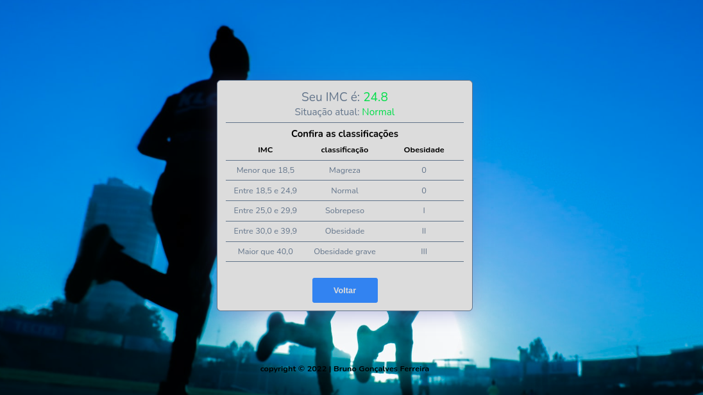

# Calculate IMC

> Projeto

A aplcação foi projetada para ser uma calculadora de IMC ( Indice de massa corporal ).

  <a href="#-tecnologias">Tecnologias</a>&nbsp;&nbsp;&nbsp;|&nbsp;&nbsp;&nbsp;
  <a href="#-projeto">Projeto</a>&nbsp;&nbsp;&nbsp;

 

[Clique aqui para acessar]()

 

## 🚀 Tecnologias

Esse projeto foi desenvolvido com as seguintes tecnologias:

- Javascript
- HTML
- CSS
- Git e Github

 

## 💻 Projeto

O usuário pode verificar o seu indice de massa corporal, como resultado ele é informado sobre seu peso,  podendo saber a situação NORMAL ou OBESIDADE. É mostrado uma tabela com as classificações.

 

---

Feito com ♥ by Bruno Gonçalves Ferreira - [Linkedin](https://www.linkedin.com/in/bruno-goncalves-ferreira/) - [Instagram](https://instagram.com/brunogonferreira) - [Twitter](https://twitter.com/BrunoGoferreir) - [Github](https://github.com/brunogoncalvesferreira)
